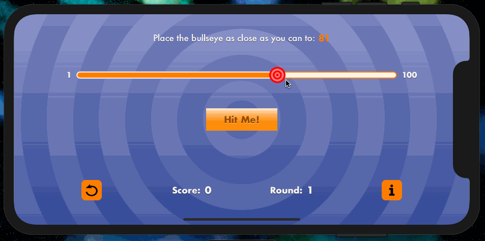
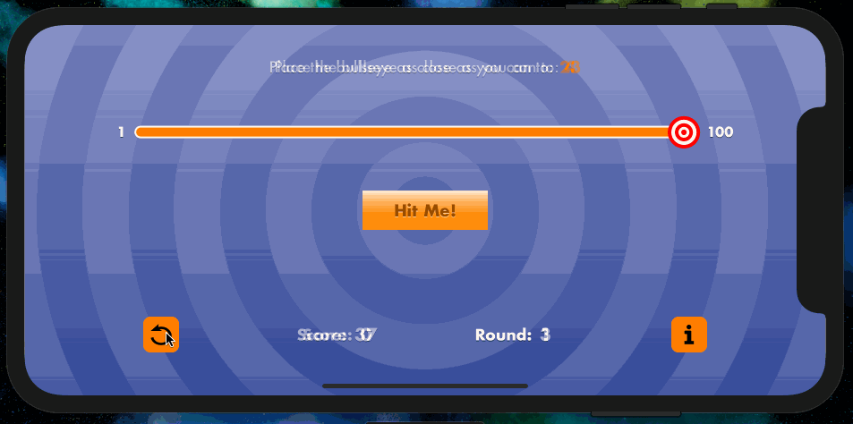
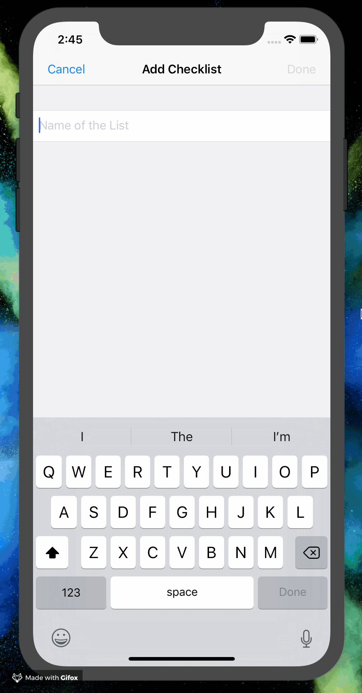

# iOS Apprentice

_Projects, playgrounds, and other material made while following along with the Ray Wenderlich book [_iOS Apprentice_](https://store.raywenderlich.com/products/ios-apprentice).

# Project Portfolio

## [BullsEye](./BullsEye/)

_A game testing the user's ability to drag a slider the a specific number_.

  

### Topics Covered / Challenges Encountered

- Sliders, labels, and other common UIKit controls.
- Building responsive interfaces that adapt to all screen sizes.
- Responding to UI events and updating state as a result.
- Designing and integrating custom artwork into a view.

 

### 📸 Moar Screenshots

  

 

## [Checklists](./Checklists/)

_ _.

  

### Topics Covered / Challenges Encountered

- Handling `UITextFieldDelegate` events to dynamically enable/disable submission buttons.

  

    
  

- Implementing a custom `UIPickerView` with custom cell views.

 

### 📸 Moar Screenshots

  

 

