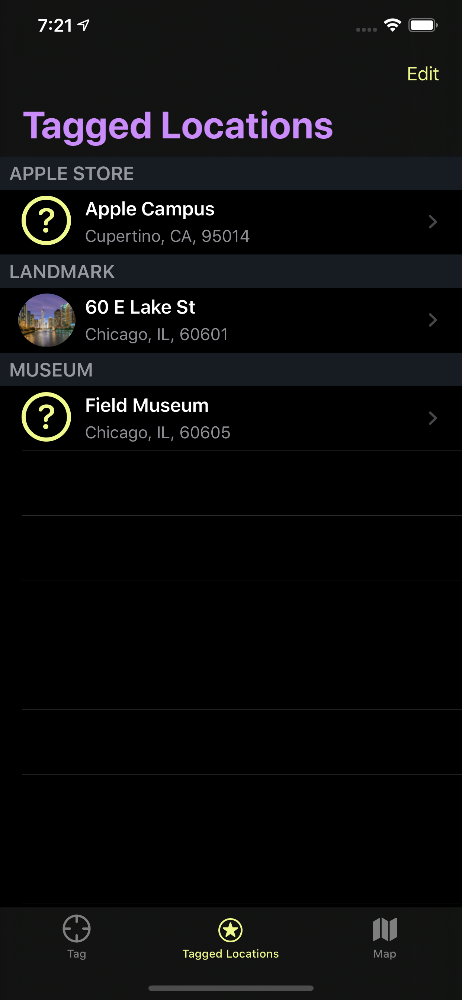

# iOS Apprentice

_Projects, playgrounds, and other material made while following along with the Ray Wenderlich book [_iOS Apprentice_](https://store.raywenderlich.com/products/ios-apprentice).

# Project Portfolio

## [BullsEye](./BullsEye/)

_A game testing the user's ability to drag a slider the a specific number_.

  

### Topics Covered / Challenges Encountered

- Sliders, labels, and other common UIKit controls.
- Building responsive interfaces that adapt to all screen sizes.
- Responding to UI events and updating state as a result.
- Designing and integrating custom artwork into a view.

 

### 📸 Moar Screenshots

  

 

----

 

## [Checklists](./Checklists/)

_List of lists with scheduling support and reminder notifications... Table Views and To-Do on steroids._

  

### Topics Covered / Challenges Encountered

- Table Views and more table views.
- Designing deep navigation flows, utilizing segues and protocols to communicate and handle actions along the way.
- Handling `UITextFieldDelegate` events to dynamically enable/disable submission buttons.

  

    
  

- Registering and managing local notifications for instances of checklist items.
- Architecting an app data model.
- Using user documents to saving and load data across application instances.
- Using `UserDefaults` to saving and load user preferences and app view state across application instances.
- Using a custom global theme color.

 

### 📸 Moar Screenshots

  
  

 

----

 

## [My Locations](./MyLocations/)

_An app that uses Core Location to fetch the user's current GPS coordinates, allowing them to "tag" a current location and add custom information to it. Additionally, these tagged locations are displayed as pins on an interactive map_.

  

### Topics Covered / Challenges Encountered

- Using Core Location: Fetching the user's current location, checking reading accuracy, handling errors and permissions, creating `CLLocation` and `CLPlacemark` models from location readings, etc.

  

- Using Core Data: Designing fetch requests, using `NSFetchedResultsController` with table views, persisting changes, caching, configuring dynamic blob storage for images, and more.

  

- Integrating enums properties with Core Data entities.
- Using Core Animation to present a richer launch experience.
- Integrating sound effect to confirm completion of long-running background operations.
- Creating custom art and imagery for animations.
- Creating custom theme colors for light and dark mode.
- Creating/configuring custom theming and appearance settings.
- Using a tabbed view controller with the coordinator pattern.
- Creating custom, interactive map view pins and annotations.

 

### 📸 Moar Screenshots

  
  
  
  

 

----

 

## [Store Search](./StoreSearch/)

__.

  

### Topics Covered / Challenges Encountered

 

### 📸 Moar Screenshots

 
